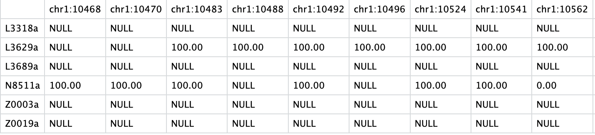

# Methylation analysis of nanopore data

This document aims to present the workflow for conducting methylation analysis of nanopore data.

## Features

From FAST5 data, this workflow allows : 

* Convert FAST5 data to POD5 data 
* Base Calling with [Dorado](https://github.com/nanoporetech/dorado?tab=readme-ov-file#features)
* Methylation Calling with [Modkit](https://github.com/nanoporetech/modkit)
* Build methylation percent matrix
* Do a PCA for the data visualization

Python must be downloaded to your working server to complete certain steps.

Depending on the size of the data processed, consider using screen.

## Workflow


## Set up 

To begin, we need to create the work space in Linux environnement. 

Where you work, create : 

* Folder "methylation_analysis" :
  
```bash
mkdir methylation_analysis
```
* Folder "image_singularity" in the last folder created : 

```bash
mkdir image_singularity
```

* Inside "image_singularity" create the images for tools with [Docker hub](https://hub.docker.com):

```bash
singularity build fast5_to_pod5.sif docker://chrisamiller/pod5-tools:0.2.4 # Convert FAST5 to POD5
singularity build dorado.sif docker://nanoporetech/dorado:shaa5cd803bdb5f3cac5c612e47ea6391b882861b8b # Dorado 
singularity build modkit.sif docker://ontresearch/modkit:mr398_shab20df82474168dd15e8ace78ff38b8bcb8b7b6fb # Modkit
singularity build samtools.sif docker://biocontainers/samtools:v1.9-4-deb_cv1 # Samtools
```

* Copy your data in FAST5 format inside the folder "methylation_analysis"

* Download a reference genome in "reference" folder :

```bash
mkdir reference # Create this folder insite "methylation_analysis"
```


## Step 1 - Convert FAST5 data do POD5 data

```bash
mkdir ./data_pod5

data_folder=$(find [/path/to/data] -mindepth 1 -maxdepth 1 -type d)
destination="[./methylation_analysis/data_pod5"

for folder in $data_folder; do
    id_patient=$(basename "$folder")
    mkdir -p "$destination/$id_patient"
    
    singularity exec --nv ./methylation_analysis/image_singularity/fast5_to_pod5.sif pod5 convert fast5 "$folder"/*.fast5 --output "$destination/$id_patient" --one-to-one "$folder"
done
```
## Step 2 - Base Calling with Dorado

```bash
mkdir ./result_dorado

data_folder=$(find ./methylation_analysis/data_pod5 -mindepth 1 -maxdepth 1 -type d)

for folder in $data_folder; do
    id_patient=$(basename "$folder")

    singularity exec --nv ./methylation_analysis/image_singularity/dorado.sif dorado basecaller --reference ./methylation_analysis/reference/*.fasta /models/dna_r10.4.1_e8.2_400bps_hac@v4.1.0 "$folder" --modified-bases-models /models/dna_r10.4.1_e8.2_400bps_hac@v4.1.0_5mCG_5hmCG@v2 > ./methylation_analysis/result_dorado/"$id_patient.bam"
done
```
## Step 3 - Indexing and sorted BAM files

```bash
bam_file=$(find ./methylation_analysis/result_dorado/*.bam)

for bam in $bam_file; do
    id_patient=$(basename "$bam" .bam)
    sorted_bam="./methylation_analysis/result_dorado/${id_patient}_sorted.bam"
    
    singularity exec --nv ./methylation_analysis/image_singularity/samtools.sif samtools sort -o "$sorted_bam" "$bam"
    
    singularity exec --nv /methylation_analysis/image_singularity/samtools.sif samtools index "$sorted_bam"
done
```

## Step 4 - Methylation Calling with Modkit

```bash
mkdir ./result_modkit

bam_file_sorted=$(find ./methylation_analysis/result_dorado/*_sorted.bam)

for bam in $bam_file_sorted; do 
    id_patient=$(basename "$bam" _sorted.bam)
    
    singularity exec --nv ./methylation_analysis/image_singularity/modkit.sif modkit pileup "$bam" ./methylation_analysis/result_modkit/"$id_patient.bed" --ref ./methylation_analysis/reference/*.fasta --combine-strands --cpg
done
```
## Step 5 - Filtering BED files

```bash
bed_file=$(find ./methylation_analysis/result_modkit/*.bed)

for bed in $bed_file; do
    id_patient=$(basename "$bed" .bed)
    awk '$4=="m"' "$bed" > "./methylation_analysis/result_modkit/${id_patient}_filtered.bed"
done
```
## Step 6 - Build methylation percent matrix

### Retrieving information of interest in a TXT file

```bash
mkdir ./matrix
mkdir ./matrix/bed_modified
mkdir ./matrix/result_matrix

bed_file=$(find ./methylation_analysis/result_modkit/*_filtered.bed)

for bed in $bed_file; do
    id_patient=$(basename "$bed" _filtered.bed);     
    awk -v pid="$id_patient" '{print pid, $1":"$2, $11}' "$bed" > "./matrix/bed_modified/${id_patient}_modified.txt";
done
```
### Creation of the matrix

```python
import os
import csv

# Path to the directory and bed modified 
bed_modified = './matrix/bed_modified'
directory = './matrix/result_matrix'


# Dictionary to store data
data = {}


# Browse all files in bed_modified
for filename in os.listdir(bed_modified):
   if filename.endswith('.txt'):
       filepath = os.path.join(bed_modified, filename)
       with open(filepath, 'r') as file:
           for line in file:
               parts = line.strip().split()
               col1, col2, col3 = parts[0], parts[1], parts[2]
               if col1 not in data:
                   data[col1] = {}
               data[col1][col2] = col3


# Identify unique values ​​for row and column headers
unique_col1 = sorted(data.keys())
unique_col2 = sorted({col2 for col1_data in data.values() for col2 in col1_data.keys()})


# Create the matrix with default None values
matrix = {col1: {col2: None for col2 in unique_col2} for col1 in unique_col1}


# Fill the matrix with the appropriate values
for col1, col2_data in data.items():
   for col2, col3 in col2_data.items():
       matrix[col1][col2] = col3


# Write the matrix to a CSV file
output_filepath = os.path.join(directory, 'combined_matrix.csv')
with open(output_filepath, 'w', newline='') as csvfile:
   writer = csv.writer(csvfile)
   # Écrire les en-têtes de colonne
   writer.writerow([''] + unique_col2)
   # Écrire les lignes de la matrice
   for col1 in unique_col1:
       row = [col1] + [matrix[col1][col2] if matrix[col1][col2] is not None else 'NULL' for col2 in unique_col2]
       writer.writerow(row)


print(f'Matrix created successfully in {output_filepath}')
```
#### Matrix example



Columns : genomic position 
Rows : Id patient
Data : methylation percent


