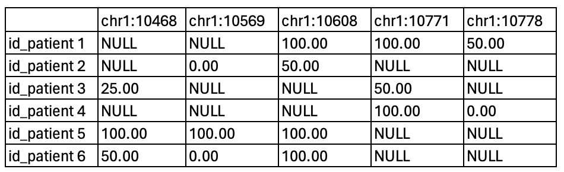

# Methylation analysis of Nanopore data
This document aims to present the workflow for conducting methylation analysis of nanopore data.

## Features
From FAST5 data, this workflow allows: 

* Convert FAST5 data to POD5 data 
* Base Calling with [Dorado](https://github.com/nanoporetech/dorado?tab=readme-ov-file#features)
* Methylation Calling with [Modkit](https://github.com/nanoporetech/modkit)
* Build methylation percent matrix
* Do a PCA for the data visualization

## Languages
Le script have been developed in bash and python languages.
So, Python must be downloaded to your working server to complete certain steps. You also need [numpy](https://numpy.org) and [pandas](https://numpy.org) packages.

## Tips 
Depending on the size of the data processed, consider using [screen](https://doc.ubuntu-fr.org/screen).

## Reference
The version of the reference genome is as follows: [Genome reference](https://ftp.ensembl.org/pub/release-112/fasta/homo_sapiens/dna/Homo_sapiens.GRCh38.dna.alt.fa.gz).
The version of the annotation genome file is as follows: [Annotation genome file](https://ftp.ensembl.org/pub/release-112/gtf/homo_sapiens/Homo_sapiens.GRCh38.112.gtf.gz).

Script for upload the references in your workspace: 
```bash
# The genomic reference file
GENOME_URL="https://ftp.ensembl.org/pub/release-112/fasta/homo_sapiens/dna/Homo_sapiens.GRCh38.dna.alt.fa.gz"
wget -O Homo_sapiens.GRCh38.dna.primary_assembly.fa.gz "$GENOME_URL"
gunzip Homo_sapiens.GRCh38.dna.primary_assembly.fa.gz


# The genomic annotation file
ANNOTATION_URL="https://ftp.ensembl.org/pub/release-112/gtf/homo_sapiens/Homo_sapiens.GRCh38.112.gtf.gz"
wget -O Homo_sapiens.GRCh38.112.gtf.gz "$ANNOTATION_URL"
gunzip Homo_sapiens.GRCh38.112.gtf.gz
```

## Workflow


## Singularity images 
To begin, your need to build the images for tools with [Docker hub](https://hub.docker.com):

```bash
singularity build fast5_to_pod5.sif docker://chrisamiller/pod5-tools:0.2.4 # Convert FAST5 to POD5
singularity build dorado.sif docker://nanoporetech/dorado:shaa5cd803bdb5f3cac5c612e47ea6391b882861b8b # Dorado 
singularity build modkit.sif docker://ontresearch/modkit:mr398_shab20df82474168dd15e8ace78ff38b8bcb8b7b6fb # Modkit
singularity build samtools.sif docker://biocontainers/samtools:v1.9-4-deb_cv1 # Samtools
```

## Start the analysis
Now you can start your analyses:

* Step files: individual steps of the workflow
* The all script file: all analyzes to run

## Result basic matrix example



* Columns : genomic position 
* Rows : patient identification
* Data : methylation percent

### Group by Gene with annotation file

There are many NULL values, it is possible to group the genomic positions by genes with an annotation file : ([GTF file](https://ftp.ensembl.org/pub/release-112/gtf/homo_sapiens/Homo_sapiens.GRCh38.112.gtf.gz))

#### To create an annotation CSV file

```python3
import csv

chromosomes_canon = {str(i) for i in range(1, 23)}.union({'X', 'Y', 'MT'})

with open('./reference/Homo_sapiens.GRCh38.112.gtf', 'r') as gtf_file, open(
  './reference/annotations.csv', 'w', newline='') as csv_file:
  gtf_reader = csv.reader(gtf_file, delimiter='\t')
  csv_writer = csv.writer(csv_file)

  for rows in gtf_reader:
    if len(rows) >= 9 and rows[0] in chromosomes_canon:
      columns = [rows[0], rows[2], rows[3], rows[4]]

      gene_id = None
      infos = ligne[8].split(';')
      for info in infos:
        if info.strip().startswith('gene_id'):
          gene_id = info.strip().split('"')[1]
          break

      columns.append(gene_id)

      csv_writer.writerow(columns)
```

#### To create an matrix per gene

```python3
import pandas as pd
import numpy as np

meth_data = pd.read_csv('./matrix/result_matrix/matrix.csv', index_col=0)
annotations = pd.read_csv('./reference/annotations.csv', header=None,
                          names=['chrom', 'type', 'start', 'end', 'gene'])

gene_annotations = annotations[annotations['type'] == 'gene']

def find_gene(chrom_pos):
  chrom, pos = chrom_pos.split(':')
  pos = int(pos)
  gene = gene_annotations[(gene_annotations['start'] <= pos) &
                          (gene_annotations['end'] >= pos)]['gene']
  return gene.values[0] if not gene.empty else None

meth_data.columns = pd.MultiIndex.from_tuples([(find_gene(col), col) for col in meth_data.columns])

meth_data = meth_data.loc[:, meth_data.columns.get_level_values(0).notna()]

meth_mean_per_gene = meth_data.T.groupby(level=0).mean().T

meth_mean_per_gene.to_csv('gene_matrix.csv')
```

## Step 7 - Do a PCA for the data visualization


