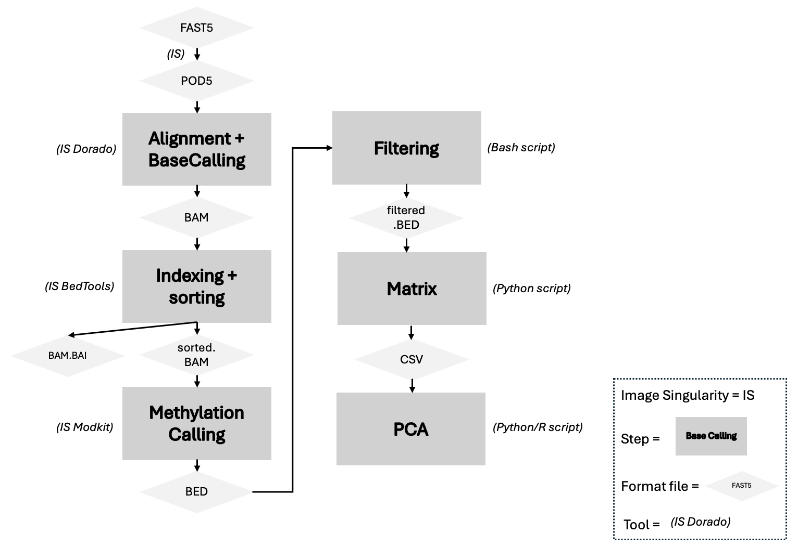

# Methylation analysis of Nanopore data
This document aims to present the workflow for conducting methylation analysis of nanopore data.

## Features
From FAST5 data, this workflow allows: 

* Convert FAST5 data to POD5 data 
* Base Calling with [Dorado](https://github.com/nanoporetech/dorado?tab=readme-ov-file#features)
* Methylation Calling with [Modkit](https://github.com/nanoporetech/modkit)
* Build methylation percent matrix
* Do a PCA for the data visualization

## Languages
The scripts have been developed in bash and python languages.
So, Python must be downloaded to your working server to complete certain steps. You also need [numpy](https://numpy.org) and [pandas](https://numpy.org) packages.

## Tips 
Depending on the size of the data processed, consider using [screen](https://doc.ubuntu-fr.org/screen).

Some functionality:
```bash
screen -S screen_name # To create screen 
screen -r screen_name # To recover an existing screen
ctrl a d # To quit screen 
screen -ls # To see the screen list
```

## Toolbox
This part is the toolbox of basic functionalities to perform the analyzes. 

```bash
cd folder_name # To moove in the folder 
ls # To see the contents of the folder
nano bash_script.sh # To create bash script or modify it if the script exists 
bash bash_script.sh # To start bash script
nano python_script.py # To create python script
python3 python_script.py # To start python script
head file_name / cat file_name / ls file_name / less file_name # To see the file 
```

## Reference
The version of the reference genome is as follows: [Genome reference](https://ftp.ensembl.org/pub/release-112/fasta/homo_sapiens/dna/Homo_sapiens.GRCh38.dna.alt.fa.gz).
The version of the annotation genome file is as follows: [Annotation genome file](https://ftp.ensembl.org/pub/release-112/gtf/homo_sapiens/Homo_sapiens.GRCh38.112.gtf.gz).

Script for upload the references in your workspace: 
```bash
# The genomic reference file
GENOME_URL="https://ftp.ensembl.org/pub/release-112/fasta/homo_sapiens/dna/Homo_sapiens.GRCh38.dna.alt.fa.gz"
wget -O Homo_sapiens.GRCh38.dna.primary_assembly.fa.gz "$GENOME_URL"
gunzip Homo_sapiens.GRCh38.dna.primary_assembly.fa.gz


# The genomic annotation file
ANNOTATION_URL="https://ftp.ensembl.org/pub/release-112/gtf/homo_sapiens/Homo_sapiens.GRCh38.112.gtf.gz"
wget -O Homo_sapiens.GRCh38.112.gtf.gz "$ANNOTATION_URL"
gunzip Homo_sapiens.GRCh38.112.gtf.gz
```

## Workflow


## Singularity images 
To begin, your need to build the images for tools with [Docker hub](https://hub.docker.com):

```bash
singularity build fast5_to_pod5.sif docker://chrisamiller/pod5-tools:0.2.4 # Convert FAST5 to POD5
singularity build dorado.sif docker://nanoporetech/dorado:shaa5cd803bdb5f3cac5c612e47ea6391b882861b8b # Dorado 
singularity build modkit.sif docker://ontresearch/modkit:mr398_shab20df82474168dd15e8ace78ff38b8bcb8b7b6fb # Modkit
singularity build samtools.sif docker://biocontainers/samtools:v1.9-4-deb_cv1 # Samtools
```
## Copy data
To copy FAST5 files in the server, you can use the following strategy: 

* Step 1 : create 'data_import.txt' file with in the first collumn the patient id, an tabulation and in the second collumn the path toward fast5 files of this patient.
Example:
```txt
id_patient1  /path/toward/fast5/files/of/the/patient/with/id/is/id_patient1
id_patient2  /path/toward/fast5/files/of/the/patient/with/id/is/id_patient2
id_patient3  /path/toward/fast5/files/of/the/patient/with/id/is/id_patient3
```
Warning : pay attention of the slashes. This '/' is accepted, not that '\'.

Import or create this file in the server of analysis.

* Step 2 : create the bash script 'copy_fast5.sh' and copy the code from the git file "copy fast5".
  
* Step 3 : start the last script in the screen (because it can be long) thinking about putting the right path towards 'data_import.txt'.

## Start the analysis
Now you can start your analyses:

* Step files: individual steps of the workflow.
Note : Remember to update the paths!

* The all script file: all analyzes starting from fast5 raw files up to the basic matrix.
Note : The script with all analysis allow to download all singularity images and references files.


